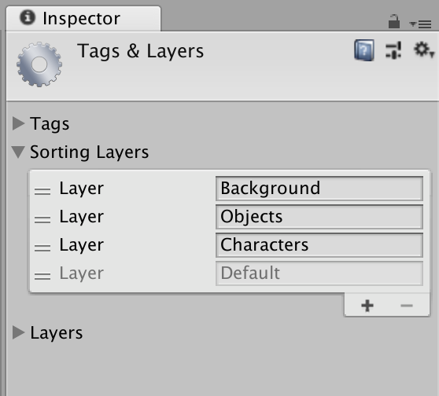

# Building World

This workshop will cover creating maps, adding items, enabling collision, and so on.

### Sorting Layers

First, a word of warning/advice. There are two things called "Layers" in Unity. "Sorting Layers" are how objects are seen by the camera. The "Layers" accessed in the toolbar are for grouping objects by how they should interact with other objects. For the most part, we will be using "Sorting Layers".  
 
Select any Game Object to open up its Inspector. Under the `Sprite Renderer` component, there should be a field called `Sorting Layer`. By default, everything is put on the `Default` layer. We want to create three sorting layers: background, objects, and characters. 
 
Hit the plus sign to add the three new layers. "Default" should stay lowest, followed by "Characters", then "Objects", and finally "Background". Ironically, lower layers in this list will display above higher layers. 
Click on our player Game Object. Change its Sorting Layer to `Characters`. Change the grass's Sorting Layer to `Background`. At the moment, we don't have any objects, but that's about to change. In future, know that you can select multiple Game Objects to change their layer all at once. 

### Enabling Collisions

There are two components needed to enable collision. One, a RigidBody2D component. This allows a Game Object to have physics at all. The second is some kind of Collider component. There are several, separated by shape. BoxCollider2D is the simplest, but you can have circle, capsule, or custom shapes as well. 
